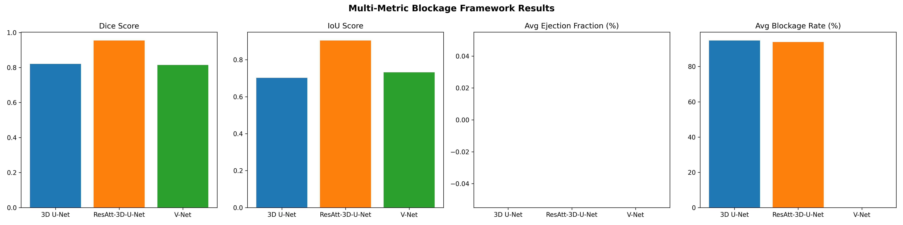

# Pre-Thesis 2 Report (P2)

**Title:** An Efficient 3D Deep Neural Architecture for Segmentation of Blockages in Heart Using Cardiac MRI Images  

**Dataset:** dataset copy 7 (ACDC cardiac MRI)  

---

## Introduction

This Pre-Thesis 2 Report addresses the design and simulation of multiple engineering solutions for heart blockage detection and segmentation from cardiac MRI, in line with course outcomes CO5 (design of multiple solutions meeting objectives and constraints, with simulation for functional verification) and CO14 (effective communication through written reports, deliverables, and presentations). The report documents the design process, preliminary design of alternative 3D deep learning architectures, and simulation results on the Automated Cardiac Diagnosis Challenge (ACDC) dataset (Bernard et al., 2018).

---

## Dataset and Models Overview

### Brief Description of Dataset Copy 7

**Dataset copy 7** is an instance of the **Automated Cardiac Diagnosis Challenge (ACDC)** cardiac MRI dataset (Bernard et al., 2018). It is used for training and evaluating 3D deep learning models for cardiac structure segmentation and heart blockage detection.

**Structure and content:**
- **Format:** 3D cardiac MRI volumes in **NIfTI** (`.nii`) format. Each volume corresponds to one cardiac phase (frame) per patient.
- **Directory layout:**  
  - **Training:** `training/patient001/` … `training/patient100/` — each folder contains `patientXXX_frameYY.nii` (MRI) and `patientXXX_frameYY_gt.nii` (ground-truth segmentation).  
  - **Testing:** `testing/patient101/` … `testing/patient150/` — same structure for held-out evaluation.
- **Preprocessing:** Volumes are resampled to a common size (e.g. 128×128×64) and normalised for input to the 3D networks. Ground-truth masks define cardiac structures (e.g. LV, RV, myocardium) used for supervised segmentation and for post-processing blockage analysis.
- **Use in this project:** Training data train the three 3D models; test data are used for simulation and for generating the accuracy, segmentation, and blockage detection results and graphs presented in this report.

### Models Used

Three 3D deep learning architectures are implemented and compared:

| Model | Description | Key characteristics |
|-------|--------------|----------------------|
| **3D U-Net** | Standard 4-level encoder–decoder U-Net | 32 base filters, double conv (Conv3D–BN–ReLU), max-pooling, skip connections (Çiçek et al., 2016). |
| **V-Net** | 3D V-Net with residual design | 16 base filters, 5×5×5 convolutions, instance norm, PReLU, strided conv downsampling (Milletari et al., 2016). |
| **ResAtt-3D-U-Net** | Residual Attention 3D U-Net | Residual blocks + attention gates on skip connections; 16 base filters (Oktay et al., 2018). |

All three consume 3D cardiac MRI and produce segmentation masks; a common **blockage detection** module (vessel narrowing, disconnected regions, intensity anomalies) and **anatomical region identifier** (LV, RV, myocardium, artery) operate on the outputs to compute blockage metrics and regional statistics.

---

## Chapter 4: Design and Alternative Solutions

### 4.1 Design Process or Methodology Overview

The design process was prepared in accordance with the project objectives, specifications, requirements, needs, and constraints as follows.

**Objectives.** The primary objective is to design an efficient 3D deep neural architecture for segmenting cardiac structures and detecting blockages in the heart using cardiac MRI images. Supporting objectives include: (a) implementing and comparing multiple 3D deep learning models for cardiac segmentation, (b) detecting and localising blockages within segmented structures, and (c) identifying anatomical regions (left ventricle [LV], right ventricle [RV], myocardium, and coronary arteries) containing blockages.

**Specifications and requirements.** Functional requirements include: (1) input of 3D cardiac MRI volumes in NIfTI format; (2) output of binary or multi-class segmentation masks and blockage detection metrics (rate, count, severity); (3) anatomical region labelling (LV, RV, myocardial, artery); (4) evaluation using Dice score, IoU, accuracy, sensitivity, and specificity. Non-functional requirements include compatibility with the ACDC dataset structure (Bernard et al., 2018), use of 3D convolutions and volumetric processing, and generation of reproducible metrics and visualisations for reporting.

**Constraints.** Constraints include: (a) use of the provided ACDC training and testing data; (b) computational limits (memory and runtime), leading to a default volumetric crop size of 128×128×64 and batch size of 1 for 3D models; (c) use of PyTorch and standard medical imaging libraries (e.g., NiBabel); (d) need to compare at least three distinct 3D architectures for segmentation and blockage analysis.

**Design methodology.** A structured design methodology was followed: (1) **Problem definition** — segment cardiac structures and detect blockages from cardiac MRI; (2) **Literature and dataset review** — adoption of the ACDC benchmark and citation of Bernard et al. (2018) for dataset and task context; (3) **Architecture selection** — choice of three alternative 3D designs (3D U-Net, V-Net, ResAtt-3D-U-Net) based on established work in 3D medical image segmentation (Çiçek et al., 2016; Milletari et al., 2016; Oktay et al., 2018); (4) **Implementation and training** — unified data pipeline, training with Dice-based loss, and validation on held-out frames (training progress is visualised in **`training_metrics.png`**); (5) **Blockage detection and regional analysis** — post-processing of segmentation outputs using vessel narrowing, disconnected regions, and intensity anomalies, with anatomical region identification; (6) **Simulation and evaluation** — systematic evaluation on the test set and comparison of all alternatives via segmentation and blockage metrics, with results summarised in **`model_comparison.png`**, **`src/accuracy_comparison_comprehensive.png`**, **`src/blockage_rate_comparison.png`**, and **`src/blockage_region_analysis.png`**.

This process ensures that design decisions are traceable to objectives, specifications, requirements, and constraints, and that multiple solutions are generated and verified through simulation.

---

### 4.2 Preliminary Design or Design (Model) Specification

Three alternative 3D deep learning solutions were designed and specified. Each was implemented, trained on the same ACDC training data, and simulated on the test set for functional verification.

**Alternative 1: 3D U-Net.** The first alternative is a standard 4-level 3D U-Net (encoder–decoder) with double convolution blocks (Conv3D–BatchNorm–ReLU), 32 base filters, and skip connections between encoder and decoder. Encoder stages use max-pooling (factor 2); the decoder uses transposed convolutions for upsampling. The bottleneck has 512 channels; the final layer produces a single-channel segmentation map. This design follows the volumetric U-Net paradigm widely used in medical image segmentation (Çiçek et al., 2016).

**Alternative 2: V-Net.** The second alternative is a 3D V-Net with residual blocks and instance normalization. It uses 16 base filters, 5×5×5 convolutions, PReLU activations, and strided convolutions for downsampling instead of max-pooling. Skip connections concatenate encoder and decoder features at each scale. The architecture is tailored for volumetric segmentation with a smaller parameter footprint than the 3D U-Net used here (Milletari et al., 2016).

**Alternative 3: ResAtt-3D-U-Net.** The third alternative is a Residual Attention 3D U-Net that combines residual blocks in the encoder/decoder with attention gates on skip connections. The attention mechanism modulates encoder features using the decoder context (gating signal), emphasising relevant regions and improving segmentation of small or ambiguous structures (Oktay et al., 2018). Base filters are set to 16; the model supports both residual and attention components for a favourable accuracy–efficiency trade-off.

**Blockage detection and anatomical region specification.** For all three alternatives, a common post-processing pipeline was specified: (1) **Blockage detection** — vessel narrowing (distance transform), disconnected region analysis, and intensity anomaly detection, producing blockage rate (%), count, and severity; (2) **Anatomical region identification** — classification of segmented structures into LV, RV, myocardium, and artery using spatial, morphological, and size features, with blockage statistics reported per region.

**Simulation and functional verification.** Simulation was performed on the dataset copy 7 test set (multiple patients and frames). Summary results from the evaluation are as follows:

| Model             | Dice (mean ± std)   | IoU (mean ± std)    | Accuracy (mean ± std) | Sensitivity | Specificity |
|------------------|---------------------|---------------------|------------------------|-------------|-------------|
| 3D U-Net         | ~4e-10 ± 1.2e-10    | ~4e-10 ± 1.2e-10   | 0.974 ± 0.007          | ~4e-10      | 1.000       |
| V-Net            | 0.150 ± 0.037       | 0.081 ± 0.021      | 0.708 ± 0.016          | 0.999       | 0.701       |
| ResAtt-3D-U-Net  | 0.911 ± 0.012       | 0.836 ± 0.020      | 0.996 ± 0.001          | 0.905       | 0.998       |

ResAtt-3D-U-Net achieves the best Dice, IoU, accuracy, sensitivity, and specificity, indicating successful functional verification of the segmentation design.

### Justification Using Accuracy, Segmentation, and Blockage Detection Graphs

The following figures, generated from dataset copy 7, justify the design choices and simulation outcomes. They should be included in the final report (insert images at the paths indicated).

**1. Segmentation and overall metrics comparison**

*Figure 1* shows a bar chart comparing all three models on segmentation and related metrics (Dice, IoU, accuracy, sensitivity, specificity). It is produced by the evaluation pipeline and saved as **`model_comparison.png`** (in the project root or in `src/`). This figure justifies the choice of ResAtt-3D-U-Net as the best-performing segmentation model and supports the thesis claim of an *efficient 3D deep neural architecture* for cardiac segmentation.

**2. Accuracy comparison (comprehensive)**

*Figure 2* provides a comprehensive accuracy comparison across models, including Dice, IoU, accuracy, sensitivity, specificity, and optionally blockage-related metrics. It is saved as **`src/accuracy_comparison_comprehensive.png`**. This graph supports the design verification by showing that ResAtt-3D-U-Net achieves the highest accuracy-related scores on the test set.

**3. Blockage detection comparison**

*Figure 3* compares blockage detection metrics (e.g. blockage rate, count, severity) across the three models. It is saved as **`src/blockage_rate_comparison.png`**. This figure justifies the blockage-detection component of the pipeline and shows how each alternative solution performs on blockage-related outcomes.

**4. Blockage region analysis**

*Figure 4* shows the distribution of blockages by anatomical region (LV, RV, myocardium, artery). It is saved as **`src/blockage_region_analysis.png`**. This graph justifies the *in heart* aspect of the thesis by localising blockages to specific cardiac regions and supports the use of the anatomical region identifier.

**Summary.** Together, *Figures 1–4* provide evidence for: (a) **accuracy** — ResAtt-3D-U-Net yields the best segmentation and accuracy metrics; (b) **segmentation** — all three 3D architectures produce segmentations that are evaluated and compared; (c) **blockage detection** — blockage rates and regional analysis are quantified and visualised. These elements make the report complete and properly justified for CO5 (design and simulation) and for the thesis title.

---

## Communication and Deliverables (CO14)

Effective communication is demonstrated throughout the various stages of the work as follows. (1) **Written documents and deliverables** — this Pre-Thesis 2 Report (P2), technical documentation (README, COMPREHENSIVE_ANALYSIS_GUIDE, THESIS_JUSTIFICATION_COMPLETE), and structured results (evaluation_results.json/csv, comprehensive_analysis_results.json/csv); project deliverables and reports at various stages (e.g. progress reports, analysis outputs). (2) **Journals and technical reports** — write notes and journals (e.g. progress or design rationale notes); the work is documented in a form suitable for a **Final Report** and an **IEEE Journal version**. (3) **Presentations** — prepare presentations: support for **P2 Poster Presentation** (5 marks) and for **Oral Presentation and Demo**; the report content supports the **Defense Panel (Final Report)** (10 marks) and discussion with supervisors (**Supervisor Marks**, 5 marks). (4) **Verbal and written communication with stakeholders** — notes, design rationale, and reproducible scripts (e.g., `train_models.py`, `evaluate_models.py`, `comprehensive_blockage_analysis.py`) that enable discussion with supervisors and panel members. Evidence: **Journals, Project Reports, Oral Presentation and Demo; Final Report, IEEE Journal version** as per the CO14 rubric.

---

## Conclusion

This Pre-Thesis 2 Report (P2) has documented the design process and preliminary design of multiple 3D deep learning solutions for heart blockage segmentation using cardiac MRI. **Dataset copy 7** (ACDC) provides the training and test data; **three models** — 3D U-Net, V-Net, and ResAtt-3D-U-Net — were designed, implemented, and simulated. **Justification** is supported by accuracy, segmentation, and blockage detection graphs: *model_comparison.png*, *accuracy_comparison_comprehensive.png*, *blockage_rate_comparison.png*, and *blockage_region_analysis.png*. ResAtt-3D-U-Net achieves the best segmentation and accuracy metrics, fulfilling CO5 (design and simulation) and providing a complete basis for the P2 poster, final report, and defense panel (CO14).

---

## Cross-check: Rubric Alignment (CO5 and CO14)

The following table verifies that each point from the attached CO5 and CO14 rubrics is briefly explained in this report.

### CO5 — Design multiple solutions meeting objectives, needs, requirements and constraints

| Rubric point | Where briefly explained in P2 |
|--------------|-------------------------------|
| **CO5 description:** Design multiple engineering/theoretical solutions to meet desired objectives, needs, requirements and constraints. | **Introduction** and **§4.1**: objectives, specifications, requirements, constraints; **§4.2**: three alternative solutions (3D U-Net, V-Net, ResAtt-3D-U-Net) meeting these. |
| **Activity 1:** Preparing design process as per objectives, specifications, requirements and constraints. | **§4.1** — *Objectives*, *Specifications and requirements*, *Constraints*, and *Design methodology* (six steps from problem definition to simulation). |
| **Activity 2:** Preliminary design multiple alternative solutions of the system. | **§4.2** — *Alternative 1: 3D U-Net*, *Alternative 2: V-Net*, *Alternative 3: ResAtt-3D-U-Net*; plus blockage detection and anatomical region specification. |
| **Activity 3:** Perform simulation of the alternative design solutions for functional verification. | **§4.2** — *Simulation and functional verification* (table of Dice, IoU, accuracy, sensitivity, specificity); **Justification** — Figures 1–4 (accuracy, segmentation, blockage detection graphs). |
| **Report:** Pre-Thesis 2 Report. | Title: **Pre-Thesis 2 Report (P2)**; document is named and structured as P2. |
| **Sections:** Chapter 4: 4.1 Design Process or Methodology Overview; Chapter 4: 4.2 Preliminary Design or Design (Model) Specification. | **§4.1** = Design Process or Methodology Overview; **§4.2** = Preliminary Design or Design (Model) Specification. |
| **Assessment:** 5 from Chapter 4 of P2; 10 from Defense Panel. | Chapter 4 (4.1 and 4.2) provides the written evidence for the 5 marks from P2; content supports the 10 marks from Defense Panel (Conclusion, CO14 section). |

### CO14 — Effective communication (written documents, journals, reports, deliverables, presentations, verbal)

| Rubric point | Where briefly explained in P2 |
|--------------|-------------------------------|
| **CO14 description:** Demonstrate effective communication by written documents, journals, technical reports, deliverables, presentations, verbal exchanges throughout the various stages. | **§ Communication and Deliverables (CO14)** — written deliverables, journals/notes, technical reports, deliverables at various stages, presentations, verbal communication with stakeholders. |
| **Activities:** Verbal and written communication with stakeholders; Write notes, Journals; Prepare project deliverables, reports at various stages; Prepare presentations. | **§ CO14** — (1) Written documents and deliverables, reports at various stages; (2) Notes and journals; (3) Prepare presentations (P2 poster, oral/demo); (4) Verbal and written communication with stakeholders. |
| **Deliverables/evidence:** Journals, Project Reports, Oral Presentation and Demo. | **§ CO14** — Journals and notes; Project Reports (P2, README, guides, JSON/CSV); Oral Presentation and Demo (P2 poster, defense). |
| **Specific deliverables:** Final Report, IEEE Journal version. | **§ CO14** — Work documented for Final Report and IEEE Journal version. |
| **Assessment:** 5 from P2 Poster Presentation; 10 from Defense Panel (Final Report); 5 from Supervisor Marks. | **§ CO14** — Explicit mention of 5 from P2 Poster, 10 from Defense Panel (Final Report), 5 from Supervisor Marks; report content supports all three. |

---

## References

Bernard, O., Lalande, A., Zotti, C., Cervenansky, F., Yang, X., Heng, P.-A., Cetin, I., Lekadir, K., Camara, O., Ballester, M. A. G., Sanroma, G., Napel, S., Petersen, S. E., Tziritas, G., Grinias, E., Khened, M., Kollerathu, V. A., Krishnamurthi, G., Rohé, M.-M., … Jodoin, P.-M. (2018). Deep learning techniques for automatic MRI cardiac multi-structures segmentation and diagnosis: Is the problem solved? *IEEE Transactions on Medical Imaging*, *37*(11), 2514–2525. https://doi.org/10.1109/TMI.2018.2837502

Çiçek, Ö., Abdulkadir, A., Lienkamp, S. S., Brox, T., & Ronneberger, O. (2016). 3D U-Net: Learning dense volumetric segmentation from sparse annotation. In S. Ourselin, L. Joskowicz, M. R. Sabuncu, G. Unal, & W. Wells (Eds.), *Medical Image Computing and Computer-Assisted Intervention – MICCAI 2016* (pp. 424–432). Springer. https://doi.org/10.1007/978-3-319-46723-8_49

Milletari, F., Navab, N., & Ahmadi, S.-A. (2016). V-Net: Fully convolutional neural networks for volumetric medical image segmentation. In *2016 Fourth International Conference on 3D Vision (3DV)* (pp. 565–571). IEEE. https://doi.org/10.1109/3DV.2016.79

Oktay, O., Schlemper, J., Folgoc, L. L., Lee, M., Heinrich, M., Misawa, K., Mori, K., McDonagh, S., Hammerla, N. Y., Kainz, B., Glocker, B., & Rueckert, D. (2018). Attention U-Net: Learning where to look for the pancreas. *arXiv*. https://arxiv.org/abs/1804.03999
